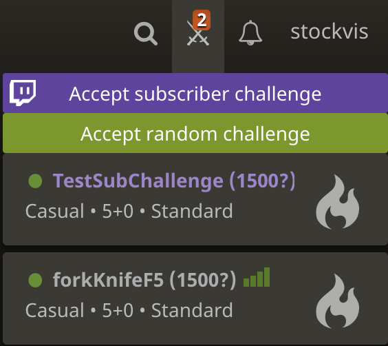

# LichessARC

This webextension adds the ability to accept random challenges on [lichess](lichess.org).

Added: accept random Twitch subscriber challenge for [Eric Rosen](https://www.twitch.tv/imrosen)

This is just the front-end of the application. The backend uses the Twitch API, python, Django framework, and sqlite and is hosted on my [website](https://tvdhout.com)

